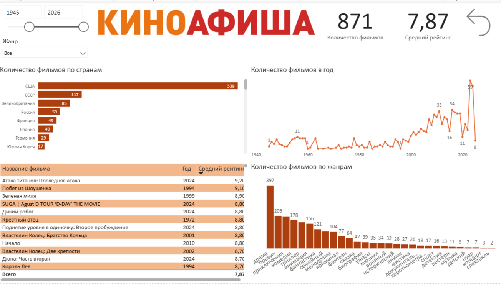
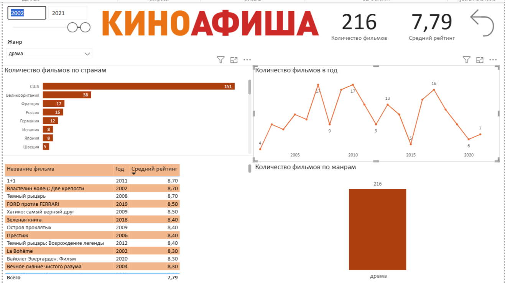

# Дашборд Power BI — Киноафиша

## Задача
Создать интерактивный дашборд для анализа 1000 лучших фильмов с сайта kinoafisha.info.

## Функциональность
- Фильтр по годам выпуска (слайдер 1945–2026)
- Фильтр по жанрам (множественный выбор из выпадающего списка)
- KPI-блоки: количество фильмов и средний рейтинг
- Кнопка сброса фильтров к базовым настройкам
- Визуализации:
  - топ стран по количеству фильмов (горизонтальная гистограмма)
  - динамика выпуска фильмов по годам (линейный график)
  - распределение фильмов по жанрам (столбчатая диаграмма)
  - таблица топ-фильмов с годом и рейтингом

## Стек
Power BI Desktop

## Скриншоты

### Общий вид (без фильтров)

Всего 871 фильм, средний рейтинг 7.87. Больше всего фильмов из США (538), СССР (117) и Великобритании (85). Пик выпуска — 2020-е годы. Самый популярный жанр — драма (397 фильмов).

### С фильтрами (жанр «драма», 2002–2021)

После применения фильтров: 216 фильмов, средний рейтинг 7.79. Лидер по количеству драм — США (151 фильм), затем Великобритания (38) и Франция (17).

## Выводы
- Дашборд позволяет в реальном времени анализировать распределение фильмов по странам, годам и жанрам.
- Фильтры дают возможность сфокусироваться на конкретном жанре и периоде.
- KPI-блоки моментально показывают изменения при работе с фильтрами.
